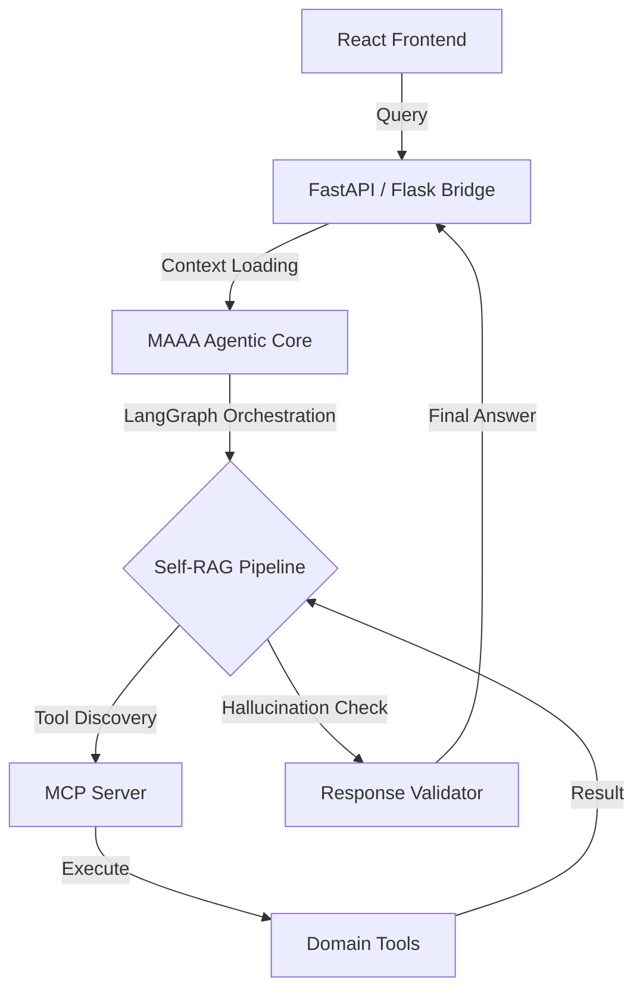

# Multi-Agent Academic Advisor (MAAA)


MAAA is a state-of-the-art Agentic AI system designed to assist students and faculty with academic policy navigation, GPA calculations, and exam scheduling. Built on the **Model Context Protocol (MCP)** and **LangGraph**, it features a sophisticated **Self-RAG (Retrieval-Augmented Generation)** pipeline with automated quality gates and feedback loops.

## 🌟 Key Features

- **Agentic Workflow**: Orchestrated by LangGraph for complex decision-making and tool-chaining.
- **Self-RAG Pipeline**: Implements self-reflective retrieval with document relevance grading and hallucination self-checks.
- **Model Context Protocol (MCP)**: Full compliance with the MCP specification for dynamic tool discovery and execution.
- **Industrial Deployment**: Containerized with Docker and monitored via integrated feedback loops and drift analysis.
- **Automated Quality Gates**: CI/CD integration with strict keyword-matching evaluation thresholds.

## 🏗️ System Architecture

MAAA follows a decoupled multi-layer architecture:



### Core Components:
- **Execution Layer**: Real-time tools for academic data processing.
- **Context Layer**: State management and persistent memory for student interactions.
- **Retrieval Layer**: ChromaDB-backed vector store for university policies.
- **Monitoring Layer**: Post-deployment feedback collection and performance drift analysis.

## 📁 Project Structure

```bash
.
├── frontend/                # Vite + React + TailwindCSS Dashboard
├── mcp_project/             # MCP Server & Core Tool Definitions
├── part_b/                  # Agentic Logic & LangGraph Implementation
│   ├── self_rag_agent.py    # Self-RAG Agent orchestration
│   └── tools.py             # Domain-specific tools (GPA, Schedule)
├── api_flask.py             # Unified API Bridge
├── app.py                   # Streamlit Monitoring Interface
├── analyze.py               # Performance & Drift Analysis Utility
├── Dockerfile               # Production-grade containerization
└── docker-compose.yml       # Stack orchestration
```

## 🚀 Getting Started

### Prerequisites
- **Python 3.11+**
- **Node.js 18+**
- **Docker** (optional, for containerized run)
- **Gemini API Key** (for LLM reasoning)

### Installation

1. **Clone the Repository**
   ```bash
   git clone https://github.com/Tajhoonmain/Multi-AgentAcademicAdvisor.git
   cd Multi-AgentAcademicAdvisor
   ```

2. **Backend Setup**
   ```bash
   pip install -r requirements.txt
   export GEMINI_API_KEY='your_key_here'
   ```

3. **Frontend Setup**
   ```bash
   cd frontend
   npm install
   ```

### Execution

#### Option 1: Standard Run
```bash
# Start the Backend Service
python api_flask.py

# In a new terminal, start the Frontend
cd frontend
npm run dev
```

#### Option 2: Docker Deployment
```bash
docker-compose up --build
```

## 📊 Monitoring & Evaluation

The system includes a built-in analysis suite to track agent performance:

- **Feedback Loop**: Integrated "Good/Bad" interaction logging.
- **Drift Analysis**: Run `python analyze.py` to identify top failed queries and system accuracy.
- **Quality Gates**: Evaluation scripts that enforce keyword-matching thresholds for critical policy queries.

## 🛡️ Security & Compliance
- **Environment Isolation**: Secure API key management via environment variables.
- **Data Protection**: Local persistence of vector databases and checkpoint stores.

## 📄 License
This project is licensed under the MIT License - see the [LICENSE](LICENSE) file for details.

## 🔗 References
- [Model Context Protocol Specification](https://modelcontextprotocol.io/)
- [LangGraph Documentation](https://github.com/langchain/langgraph)
- [Self-RAG Paper](https://arxiv.org/abs/2310.11511)
